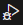
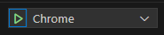

# Description
`ParkNDeploy` is an introductory DevOps course designed to guide you through deploying a basic Parking Finder App on Azure.

It follows [GitRDone](https://github.com/jraillard/gitrdone), a hands-on course to get you up to speed with version control using Git.

This course covers continuous integration and continuous deployment (CI/CD) pipelines, as well as infrastructure-as-code (IaC) practices.

## Prerequisites

### Tools

- An Azure Account in order to deploy your App :rocket: 
  - [Azure Students](./doc/azure_students.md)
  - [Classic one](https://azure.microsoft.com/pricing/purchase-options/azure-account?icid=azurefreeaccount) (you will be ask to put a credit card even if nothing is debited)

- A GitHub account in order to fork this repo and start to work :wink:

- A source code management tool :
  - Git Bash for CLI guys :sunglasses:
  - [Fork](https://git-fork.com/) for GUI guys :star:

- **[Optional]** IDEs to build the app locally : 
  - Visual Studio Community with .Net 9 SDK (Backend)
  - Visual Studio Code & Node JS >= 21.7.1 (Frontend)

### Knowledges

- **[Appreciated]** Basic repository management (commits, push, merge-request) 
- **[Optional]** Basic understanding of APIs
- **[Optional]** Basic understanding of SPAs

## Build the App locally

[Getting the project](#getting-the-project) is mandatory.
[Backend](#backend) and [Frontend](#frontend) build step will only be mandatory at the end of this workshop.

### Getting the project

First of all, you'll need to get the source code :grin: : 

- Fork this project on your personnal GitHub account 

:warning: Keep `Copy the DEFAULT branch only` option checked (to avoid conflicts between branch names).

> If you never made a fork, just follow the steps mentionned [here](https://docs.github.com/en/pull-requests/collaborating-with-pull-requests/working-with-forks/fork-a-repo#forking-a-repository) :eyes:.

- Clone the project on your local machine

> Again, if you never did it, just follow the steps mentionned [here](https://docs.github.com/en/pull-requests/collaborating-with-pull-requests/working-with-forks/fork-a-repo#cloning-your-forked-repository) :eyes:.

- And that's it ! :sparkles: 

> :bulb: The repository will contain the `main` branch as you're starting point. 
> You're free to use `feature branches` or not. 
> 
> If for some reasons you're blocked during this workshop, you can check 
> `solution-<currentYear>` branches on the main repository.:smirk: 

### Backend
---
Easiest one :
- Open the `ParkNDeploy.sln` file with Visual Studio 
- Hit the `Run` button using the `Project Https` profile (default one)
- Wait the Swagger API to launch on your default navigator
- You can start to play with it to see what it does :video_game:

> Some details about how the API is made and what it does could be find in the [backend README file](./backend/README.md).

### Frontend
---

Follow the next steps : 

:one: Open the `./frontend` folder with Visual Studio Code

:two: Open a command line terminal using `CTRL+ù` hotkey or through the `Terminal menu` on the top of Visual Studio Code

:three: Run the following commands : 

```bash
# This will download all the dependencies for the frontend
npm install

# This will compiles and run the frontend app under a Vite developpement server
npm run dev

# If it works, you should see a localhost URL link
```

:four: Show the app in browser, here you have two possibilities : 

- Without Visual Studio Code debugger : just `CTRL+Click` on the localhost URL that is being displayed on the terminal you just launched before

- With Visual Studio Code debugger : 
  - Hit `CTRL+SHIFT+D` hotkey or click on  in the left navigation bar
  
  - Click on  

  &rarr; Basically VS Code will run the [launch.json config](./frontend/.vscode/launch.json) which launch a Chrome navigator and attach the VS Code debugger to the frontend app process. This will allow you to debug through breakpoints and so on inside Visual Studio code (instead of spamming your source code with `console.log()` :stuck_out_tongue_winking_eye:).

> Some details about how the Frontend App is made and what it does could be find in the [frontend README file](./frontend/README.md)

## Let's dive-In !

:rocket: Buckle up, folks! It's time to blast off to the [first step](./doc/step0_studying_devops.md) of our course. Ready, set, deploy!

## Additional Resources (for DevOps enthusiastics)

First of all, I hope this initiation gave you interest into DevOps concepts and that you understand how it could help you in your day-to-day tasks in real-world project.

Now for a treasure trove of additional resources to dive deeper into DevOps concepts, check out the [**to go further section**](doc/to_go_further.md). :eyes:
