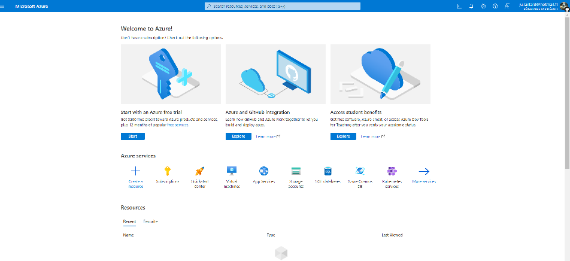

# Azure Students account

If you are a students, `Azure` make you able to get a free Azure account with some credits without the need of giving your credit card (used as insurance in classic Azure Account if you spend too much computes on Azure).

In order to create an Azure Students account, follow the next steps : 

:one: Go the [AzureStudents WebSite](https://azure.microsoft.com/free/students/)

:two: Clic on `Start free`

:three: Put your student email address

:four: Connect on your school authentication page (if there's one) and follow the steps

&rarr; you might receive a mail saying that your account has been created or that you should validate it before.

:five: Therefore you should be able to connect to [Azure Portal](https://portal.azure.com/#home) and have a screen like this : 

:six: Through the search bar, look for `Subscriptions` service

:seven: There you should have your `Azure for Students` subscription displayed

Tadah ! :sparkles: