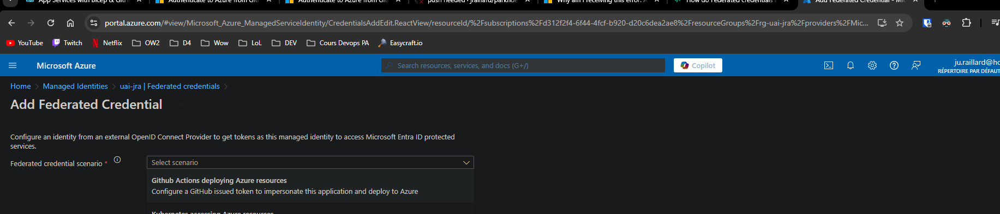

# Step 1 : Deploy ParkNDeploy API

## Provision API Infrastructure

### 

## Deploy Backend API

`WIP`

> Notes : 

Go on  https://learn.microsoft.com/en-us/azure/templates/  left search bar to find all up-to-date templates to use

ex : AppServicePlan = https://learn.microsoft.com/en-us/azure/templates/microsoft.web/2022-09-01/serverfarms?pivots=deployment-language-bicep

Connection GH & Azure https://learn.microsoft.com/en-us/azure/developer/github/connect-from-azure?tabs=azure-cli%2Clinux#use-the-azure-login-action-with-a-service-principal-secret
Learn the good way : Sign in with OpenID Connect using a Microsoft Entra application or a user-assigned managed identity (even if service principal + secret could be enough in this course)
https://learn.microsoft.com/en-us/azure/developer/github/connect-from-azure-openid-connect

As you'll be the only one to use you're subscription we'll use the second Option : User-assigned managed identity
The first one would be the options for a company (creating an application for managing multiple identities easier)

So follow the steps mentionned

For the resourcegroup specify : rg-uai-{trigram}

- rg for resource group
- uai for user assigned identity
- your trigram so that the rg name is unique

for the user assigned managed identity name just remove rg : uai-{trigram} (note : add parkndeploy ?)

AZURE_CLIENT_ID & AZURE_SUBSCRIPTION_ID could be find in your UAI ; AZURE_TENANT_ID could be find in Microsft Entra ID Service (look for it in the main azure search bar)

:warning: after creating UAI , need to create the Federated Credential . When we'll connect to Azure in our gh workflow, that's the token that will be fetched and use in every azure command

Organization : your github account name
Repository : your forked repo
...

-- 

create federated Credential of type environment => production 
organisation = account github
repo = repo name
entity = environment
env = prod
name : fed-cred-{trigram}

sooner => read the doc : assign rbac to UAI 
scope = subscriptions (can do things on every services)
role = contributor (full access despite RBAC assignment, azure blueprint management and so on => we dont need that)

+ secrets.AZURE_REGION
https://gist.github.com/ausfestivus/04e55c7d80229069bf3bc75870630ec8

repo vars : PROJECT_NAME,  AZURE_RESOURCE_IDENTIFIER => to make it unique (your trigram)
:bulb: in workflow we'll combine them in order to make our resources names uniques => every resources should be unique in azure as it bind strongly bind to service defaultHostName

we create resource group before using bicep cause bicep cannot create it first and then populate it
=> two possibilities then, create by your own or only use a basic azure cli command

here infra and app deployment are splited cause in production you would rarely do everything in single time and may want to add some validation between each steps.
That way you'll learn how to create multiple job and interact within them

go the website url shown in github logs and .. what there's a 404 ,! :impress:

quite normal : this is an API, no pages are configured to be displayed.
 
 but ! we have a swagger :D , add `/swagger` to the url and you should see something like : 
 