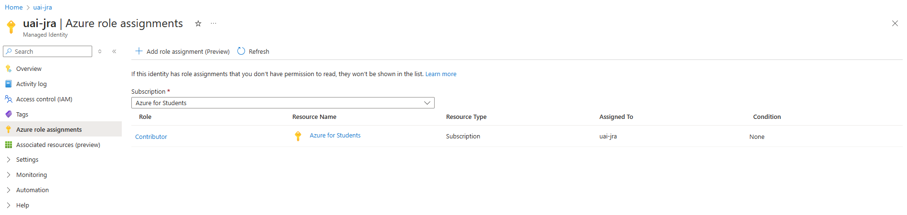
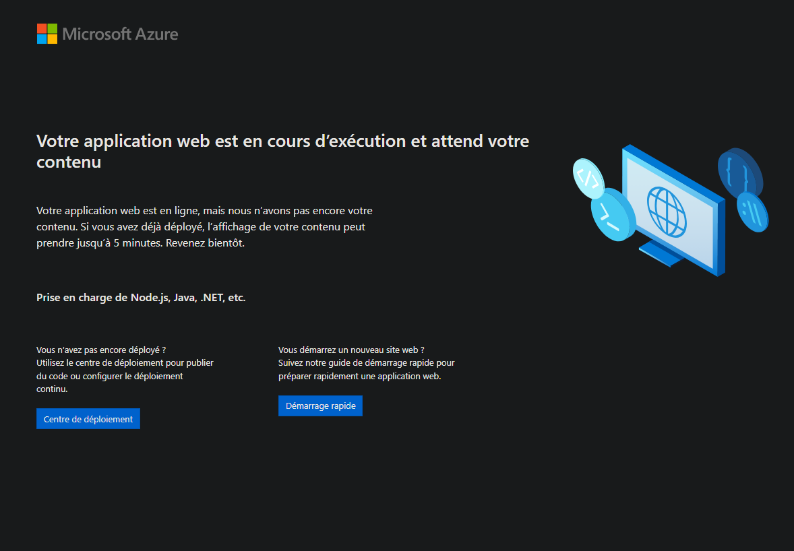
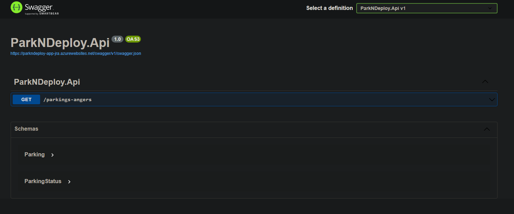

# Step 1 : Deploy ParkNDeploy API

## State about Azure resources

Before talking about `Bicep`, let's first talk a bit about Azure resources we will provision. :eyes:

We need to deploy a basic API, the Azure resource that best fit our needs is the [Azure App Service](https://azure.microsoft.com/fr-fr/products/app-service) as it is a simple Saas resource to use in that case.

An App Service should always be deployed under an `App Service Plan` : think of it like a wrapper, it allows you to do many things such as App Service instances scale or defining [deployment slots](https://learn.microsoft.com/azure/app-service/deploy-staging-slots?tabs=portal) (way too advanced for this course and therefore will not be covered :wink:).

Finally, in Azure, ***every single resources*** should be created under a `resource group`. Usually we associate it with an environment as it is, by default, ensuring compartmentalization.

Resource groups are also bound to a subscription (you're Azure Student one for example), also bound to a tenant (in your case, the one bound to your microsoft email adress).

That being said, our Azure infrastructure will look like this : 

```
tenant                                  <- no need to be provisionned (but authentication required ...)
    └── subscription                    <- no need to be provisionned (but authentication required ...)
        └── resourceGroup                  
            └── appServicePlan             
                └── appService
                    └── ** Your Wonderfull Backend **
```

## Create API Infrastructure

Finally, we'll start writing code ! :star2:

As we mentionned before, `Bicep` is the tool that will allow us to provision our infrastructure in a declarative way.

We'll going into a quite straightforward way of doing it but keep in mind that way more complex bicep projects could be made following the [official documentation](https://learn.microsoft.com/azure/azure-resource-manager/bicep/).

First of all let's create an `infrastructure` folder at the project root that will look like this :

```
├── ...
├── infrastructure                  <- folder dedicated for infrastructure
    ├── main.bicep                  <- bicep project entrypoint
    └── modules                     <- bicep modules (reusable components)
        ├── appService.bicep        <- bicep module dedicated to provision an Azure App Service
        └── appServicePlan.bicep    <- bicep module dedicated to provision an Azure App Service Plan
├── ...
```

As the previous schema induced, a bicep project should have an entrypoint : the `main.bicep` file.

It will be responsible of : 
- **defining the scope** : [multiple values](https://learn.microsoft.com/azure/azure-resource-manager/bicep/deploy-to-resource-group?tabs=azure-cli) are allowed but we will use `resourceGroup` as everything will be provision in a single resource group.
- **taking some parameters** : variables to help you name your resources for instance
- **create your resource** : through modules or directly 
- **export some outputs** : each resources exposes data that can be outputed such as the App Service default host for example

Add the following code to the `main.bicep` file :

```bicep
targetScope = 'resourceGroup' // We'll deploy the resources in the provided resource group

// Parameters to easily construct resource names
param location string
param project string

// Here we'll add an identifier to create a unique name for the App Service Plan, for example your trigram, so that everyone could deploy his own parkndeploy instance
param identifier string

// Create the AppServicePlan through the AppServicePlan module
module appServicePlan 'modules/appServicePlan.bicep' = {
  name: 'appServicePlan'
  params: {
    location: location
    project: project
    identifier: identifier
  }
}

// Create the AppService through the AppService module
module appService 'modules/appService.bicep' = {
  name: 'appService'
  params: {
    location: location
    project: project
    identifier: identifier
    planId: appServicePlan.outputs.planId // Use the appServicePlan output to get its id back => an App Service needs to reference its App Service Plan
  }
}

// Export App Service Name
output appServiceName string = appService.outputs.appServiceName
```

Only one more comment on this, `appServiceName` is being outputed as we will need it in [Deploy Backend API part](step1_deploy_backend.md#deploy-backend-api) :wink:.

Then fill the `./modules/appServicePlan.bicep` file with the following code : 

```bicep
param location string
param project string
param identifier string

resource plan 'Microsoft.Web/serverfarms@2022-09-01' = {
  name: '${project}-plan-${identifier}'
  location: location
  
  sku: {
    name: 'F1' // We use F1 pricing plan (free one) as we don't need specific features
  }
  
  kind: 'app,linux' // Allow to deploy on an App Service using Linux OS
  
  properties: {
    reserved: true // Specifity of App Service with Linux OS
  }
}

output planId string = plan.id // Export the App Service identifier
```

Pay attention about the `name` property. ***Resources names should be strictly unique in Azure***. As a best practice, every resource name should contain the [resource type abreviation](https://learn.microsoft.com/azure/cloud-adoption-framework/ready/azure-best-practices/resource-abbreviations). Some are placing it as prefix, some as suffix and some in middle : there's no restriction on it, it's **just better to be consistent on your different projects** (in order to apply rules on resources inside an organization for instance).

So for each of our resources we'll follow the following rule : projectName-resourceType-**identifier**, where identifier could be your trigram for instance (as every people in the course should have a unique resource name).

`location` is interesting too, as Azure is a cloud provider, you'll always have to specify ***where your resource is deployed***. The choice count a lot :
- it could impact resource response time (if too far from where you are)
- every resources are not allowed in every locations
- resources doesnt have the same price depending on where they are located

Finally, add the code for  `./modules/appService.bicep` file :

```bicep
param location string
param project string
param identifier string

// App Service Plan identifier that will host our App Service
param planId string

resource app 'Microsoft.Web/sites@2022-03-01' = {
  name: '${project}-app-${identifier}'
  location: location

  properties: {
    serverFarmId: planId
    reserved: true

    siteConfig: {
      linuxFxVersion: 'DOTNETCORE|9.0' // Specify to setup the .NET Core 9.0 runtime (used by our backend API) on the Linux machine under the hood
    }
  }
}

output appServiceName string = app.name // Export the App Service name for deployment
```

Well done friends, our bicep project is ready to be run, let's continue with our CD pipeline. :eyes:

## Create infrastructure deployment pipeline

Pipelines in Github are created with GitHub Action tool.

What a better way to understand the main concepts (workflows, events, jobs, actions) than read the official [getting started first page](https://docs.github.com/actions/about-github-actions/understanding-github-actions) ? :mag:

Seems clear ? Then checkout the `.github/workflows/deploy-infra-and-apps.yml` file will be using for our entire workshop :

```yaml
on: [push, workflow_dispatch]

env: 
  AZURE_RG_NAME: rg-${{ vars.PROJECT_NAME }}-${{ vars.AZURE_RESOURCE_IDENTIFIER }}
  
jobs:
  deploy_infrastructure:
    runs-on: ubuntu-latest

    steps:
    - name: Checkout repository
      uses: actions/checkout@v4

    - name: Login to Azure 
      uses: azure/login@v2
      with:
        client-id: ${{ secrets.AZURE_CLIENT_ID }}
        tenant-id: ${{ secrets.AZURE_TENANT_ID }}
        subscription-id: ${{ secrets.AZURE_SUBSCRIPTION_ID }}
        enable-AzPSSession: true 

    - name: Create resource group if not exists      
      run: |
        az group show --name ${{ env.AZURE_RG_NAME }} ||
        az group create --name ${{ env.AZURE_RG_NAME }} --location ${{ secrets.AZURE_REGION }}

    - name: Deploy bicep
      id: bicep_deploy
      uses: azure/arm-deploy@v2
      with:
        subscriptionId: ${{ secrets.AZURE_SUBSCRIPTION }}
        region: ${{ secrets.AZURE_REGION }}
        template: ./infrastructure/main.bicep
        parameters: project=${{ vars.PROJECT_NAME }} location=${{ secrets.AZURE_REGION }} identifier=${{ vars.AZURE_RESOURCE_IDENTIFIER }}
        resourceGroupName: ${{ env.AZURE_RG_NAME }}
```

Let's take a time to explain the syntax a bit : 
- the `on` keyword allows you to defined events 
  - `push` means every push on any remoted branch will trigger the workflow
  - `workflow_dispatch` means that you can trigger manually the workflow on GitHub Action tab on your GitHub repository (only work if the workflow is on the repository default branch or if you trigger it using Github CLI)
- the `env` keyword allows for defining workflow scoped environment variable, here we use it to define the resource group name we'll use multiple times
- `deploy_infrastructure` is our first job responsible of provisionning our Azure infrastructure (as its names implies)
  - `runs-on` define the **runner** where our job steps will be executed, [many are available](https://github.com/actions/runner-images) depending on your needs
  - each steps have a `name` that will be displayed on workflow run logs to easily follow the execution
  - `id` could be specified to identify a step an reference it (for getting outputs for instance ... :smirk:)
  - `uses` is used when you want to need to execute a custom action 
    - you could pass parameters to an action using `with` keyword
  - `run` allows you to simply run commands on your runner
- multiple variables are used and [allowed by GitHub actions](https://docs.github.com/actions/writing-workflows/choosing-what-your-workflow-does/store-information-in-variables):
  - `env.xxx` : mentionned before    
  - `vars.xxx` : organization (on github enterprise instance) / repository / environment scoped variables defined in your `GitHub Settings` under `Secrets and variables / Actions`
  - `secrets.xxx` : organization (on github enterprise instance) / repository / environement secrets defined in your `GitHub Settings` under `Secrets and variables / Actions`
  
  &rarr; ***Secrets are masked by default in every logs***, variables could also beeing masked by [applying one](https://docs.github.com/actions/writing-workflows/choosing-what-your-workflow-does/workflow-commands-for-github-actions#masking-a-value-in-a-log).


  > **Note** : In this workshop we're using GitHub secrets functionnality for simplicity but GitHub also allows you to store them in any third party tool such as Azure Key Vault or HashiCorp Vault for instance. :wink:

:bulb: If anytime you're looking for workflow syntax, look at the [official documentation](https://docs.github.com/actions/writing-workflows/workflow-syntax-for-github-actions) :eyes:.

Now talk about actions that will be executed : 

:one: Checkout the repository 

&rarr; Get the source code where the event was triggered on (tag, branch, repository, whatever)

:two: Login to Azure 

&rarr; Resources will be bound to your tenant & subscription, so we'll need to log in. The `enable-AzPSSession: true` option only allow us to open a PowerShell session in order to runs some az cli command right after

:three: Create resource group if not exists 

&rarr; Name is clear but why are we doing it ? Basically bicep doesnt allow us to both create resource group and provision resources inside. It is a known limitation and therefore one solution could be to provision it but using `az cli` instead of bicep scripts

:four: Deploy bicep 

&rarr; Finally, execute our bicep project !


You surely notice that this workflow is using a lot a variables, let's provision it :eyes: :
- Variables :
  - **AZURE_RESOURCE_IDENTIFIER** : put your trigram here or whatever a unique id (alphanumerical)
  - **PROJECT_NAME** : parkndeploy
- Secrets :  
  - **AZURE_REGION** : select one of this [list](https://gist.github.com/ausfestivus/04e55c7d80229069bf3bc75870630ec8) depending on when you are (for instance **francecentral** for frenchies)

  &rarr; For the following variables, you'll need to follow the [next part](./step1_deploy_backend.md#provision-azure-identity) :clipboard:.
  - **AZURE_CLIENT_ID**
  - **AZURE_SUBSCRIPTION_ID**
  - **AZURE_TENANT_ID**

## Provision Azure Identity

To deploy resources on Azure, you need to create an identity that will be allowed to do it.

There are many [ways](https://learn.microsoft.com/azure/developer/github/connect-from-azure) to do it, we'll use a `user-assigned manged identity` using **OpenID Connect** (OIDC) as it is the recommended way :
- for PoC (proof of concept) situation &rarr; more simple to create
- more secured than a basic secret using service principals 

How to do so ? 

:one: Create a user-assigned managed identity following this [doc](https://learn.microsoft.com/entra/identity/managed-identities-azure-resources/how-manage-user-assigned-managed-identities?pivots=identity-mi-methods-azp#create-a-user-assigned-managed-identity)

&rarr; For the resource group name, name it as : rg-uai-**yourIdentifier**
&rarr; for the uai itself name it : uai-parkndeploy-production-**yourIdentifier**

:bulb: **rg** for resource group and **uai** for user assigned identity

:two: Copy the values for Client ID, Subscription ID, and Directory (tenant) ID to use later in your GitHub Actions workflow.

&rarr; **AZURE_CLIENT_ID & AZURE_SUBSCRIPTION_ID** could be find in your **UAI** ; **AZURE_TENANT_ID** could be find by looking for ***"Tenant properties"*** in the search bar. You can add them as GitHub secrets as you did before with **AZURE_REGION**

:three: Assign an appropriate role to your user-assigned managed identity by going on its `Azure Role Assignement section` and using its `Add role assignment preview button`



&rarr; Set `scope` to **subscriptions** (means you can do things on your subscriptions services) and **contributor** to `role` (meaning you have full access despite Role base access assignement, azure blueprint management and so on => we dont need that at all)

:five: Configure a federated identity credential on a user-assigned managed identity to trust tokens issued by GitHub Actions to your GitHub repository **under your UAI / Settings / Federated credentials** tab

&rarr; Here you have some options to set :
- `scenario` : GitHub Actions deploying Azure resources
- `organisation` : your GitHub account storing your forked project
- `repository` : your repo name
- `entity` : environment
- `environment` : production
- `name` : parkdndeploy-gh-fed-cred-env-prod-yourIdentifier (the name should reflect your use case as you might need to create multiple one for the same uai)

:bulb: `issuer` is auto-generated and allows OIDC to recognize the caller as a GitHub action. `subject identifier` will be generated by GitHub when we'll try to connect and provision resources on Azure. Here we created a Federated Credential for when we're executing a Github Action in `production environment`.

Et voilà :sparkles:

> __TLDR__ : For simplicity here we basically create an **identity that is able to create anything in your whole Azure subscription**. This has been made for simplicity but keep in mind that it doesnt follow the ***least privilege principle***. In real-world use-case, you better would have create an identity in the same resource group you wanna deploy (to reduce impact zone).

Let's come back to our CD pipeline now. :eyes:

## Deploy Infrastructure

Before running our workflow we have two last things to add.

If you understood well when we'll connect to Azure through `azure/login@v2` action and a federated credential will be fetched.

This one should be used when provisionning resources (whether using bicep, az cli, terraform and so on).

Also our federated credential is only valid on a GitHub job executed in production environment : that's why we set `environment: production`.

That being said, add the following code in your workflow :

```yaml
# on
# ...

permissions:
  # Require write permission to Fetch an OIDC token (required for federated credential) and write it
  # It will be automatically used on actions / cli that needs it
  id-token: write

# env
# ...

deploy_infrastructure:
    runs-on: ubuntu-latest
    environment: production # bind the job to the production environment
```

Now push your work into your remoted branch (whether a feature one or main branch depending how you decided to do) and go to GitHub Actions tab on your GitHub repository, a workflow should be executing.

If you did well, everything should be green at the end :heavy_check_mark:.

You can now come back to your Azure portal and look for **"App Service"** in the main search bar.

You should find yours and on the Overview page see the `Default domain` property being displayed.

Click on it (this could take time) and .. tadah ! You're App Service is created and online :star2:.



Now let's deploy our backend API on it. :rocket:

## Deploy Backend API

Quite simple, first of all let's create the job responsible of deploying the backend API : `deploy_backend`.

Add the following code in your GitHub workflow file : 

```yaml
deploy_backend:
    runs-on: ubuntu-latest
    needs: deploy_infrastructure
    environment: production

    steps:
    - name: Checkout repository
      uses: actions/checkout@v4
    
    - name: Setup .NET SDK 9.0.x
      uses: actions/setup-dotnet@v4
      with:
        dotnet-version: '9.0.x'
        
    - name: Publish the app
      run: dotnet publish -c Release --property:PublishDir=publish # Publish the app to the API project publish folder
      working-directory: ./backend # Specify where to find the solution file in repository

    - name: Login to Azure 
      uses: azure/login@v2
      with:
        client-id: ${{ secrets.AZURE_CLIENT_ID }}
        tenant-id: ${{ secrets.AZURE_TENANT_ID }}
        subscription-id: ${{ secrets.AZURE_SUBSCRIPTION_ID }}
      
    - name: Deploy backend to App Service
      uses: azure/webapps-deploy@v2
      with: 
        app-name: ${{ needs.deploy_infrastructure.outputs.appServiceName }} # Access to the previous job output to get the appServiceName deployed with bicep
        package: ./backend/ParkNDeploy.Api/publish # Path to the previously published app
```

Let's explain it a bit : 
- `needs` clause allows you to wait a specified job before being executed, that way we ensure our infrastructure is provisionned before deploying our source code
- `Publish the app` is specific on your backend stack : for dotnet API, the dotnet publish is sufficient to create a deployable bundle
- `azure/webapps-deploy@v2` is the action that allows us to deploy our backend to Azure App Service

:bulb: Notice the `app-name` property on the `azure/webapps-deploy@v2` action, we're specifying **needs.deploy_infrastructure.outputs.appServiceName** variable value. 

As its name implies, it is a value exposed by our `deploy_infrastructure` job. This trick allows us to pass value between jobs, but we need to expose those value. :smirk:

Add the following code on the **deploy_infrastructure** job : 

```yaml
deploy_infrastructure:
    runs-on: ubuntu-latest
    environment: production

    outputs:
      appServiceName: ${{ steps.bicep_deploy.outputs.appServiceName }}
    
    steps: 
    # ...
```

Through the `outputs` keyword we're exposing key-value pairs.

Notice that here again we're using a value coming from a step, the `bicep_deploy` one : **steps.bicep_deploy.outputs.appServiceName** (that's the purpose of adding an **id** on this step :wink:).

Well, our CD pipeline is finally ready so push the code and wait for our app to be deployed. :rocket:

:bulb: In your GitHub workflow logs, you could access to the deployed API URL or you can also go through **Azure Portal** to your App Service instance and go click on **Default Domain** link.

The app can take some time to launch, but when it's done .... WUT, we got a 404 Not Found ?! :cold_sweat:

This is quite normal : it is a pure API that not exposing any endpoint on the root path, nevertheless ...

For those who read the [backend readme file](../backend/README.md), you know that our API is exposing a Swagger UI right ? :smirk:

Add `/api/swagger` to the url and you should see something like this :



Congrats, our API is finally deployed ! :sparkles:

Let's [add our UI](./step2_deploy_frontend.md) to visualize our parkings. :eyes:
