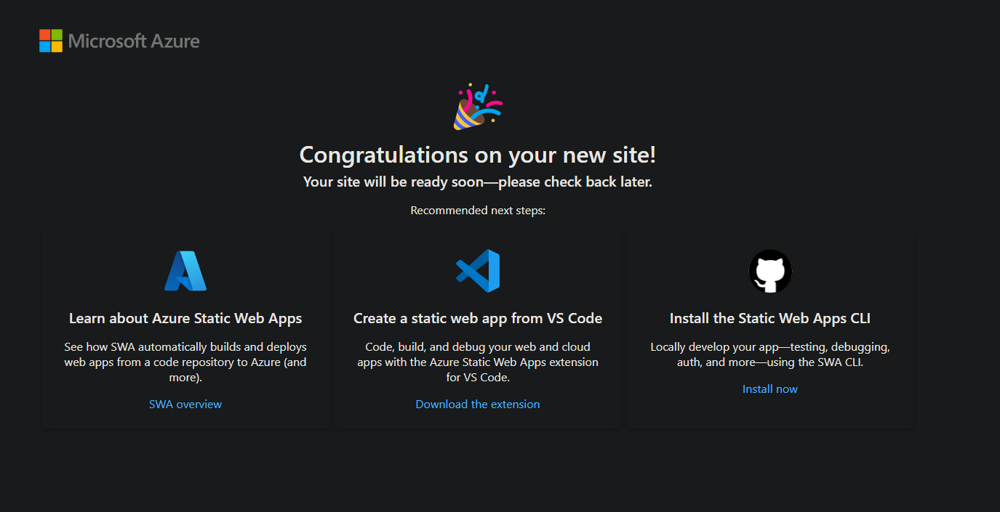

# Step 2 : Deploy ParkNDeploy Frontend

## State about Azure resources

In order to deploy a react application there's multiple ways of doing it :
- Azure App Service : quite a bit expensive (CPU wise) for an SPA
- [Azure Storage Account](https://byalexblog.net/article/react-azure-storage/) : basic storage resources allowing you to store and expose your html files (that's basically what a SPA is under the hood)
- Azure Static Web app : quite new resource created specially for static apps such as SPAs

We will then go for this option : `Azure Static Web App`.

This resource is offering tons of usefull [functionnalities](https://learn.microsoft.com/azure/static-web-apps/overview) but here we gonna stay simple : we just want to deploy our App on it.

:bulb: For instance, we not gonna use [Preview environments](https://learn.microsoft.com/azure/static-web-apps/preview-environments) (but you can after this workshop if you are interested in :smirk:).

Our new resource will be part of our previously created resource group, therefore our Azure infrastructure will look like this : 

```
tenant                                  <- no need to be provisionned (but authentication required ...)
    └── subscription                    <- no need to be provisionned (but authentication required ...)
        └── resourceGroup               <- already provisionned   
            ├── appServicePlan          <- already provisionned   
            |   └── appService          <- already provisionned
            └── staticWebApp
                └── ** Your Wonderfull Frontend **
```

## Create Frontend Infrastructure

As we did for our `App Service` resource, we gonna create a `Static Web App` bicep module.

Create a `./infrastructure/modules/staticWebApp.bicep` file with the following code : 

```bicep
param location string
param project string
param identifier string

resource swa 'Microsoft.Web/staticSites@2022-09-01' = {
  name: '${project}-swa-${identifier}'
  location: location
  
  sku: {
    name: 'Free'
  }  

  properties: {} // Even empty, it's mandatory ...
}

output swaName string = swa.name // Expose Static Web App name as we did for App Service for deployment purpose
```

Nothing fancy, it's quite a basic resource provisionning for our use case. 
> **TLDR** : Do not miss the `properties` as the documentation doesnt make it mandatory, errors logs aren't telling explicitly to you, but it took me quite a time of debugging to figure out it is mandatory. :dizzy_face:
>
> Thanks this [post](https://github.com/Azure/static-web-apps/issues/868) for giving me the answer. :pray:

Now call your module in your `./infrastructure/main.bicep` file : 

```bicep
param swaLocation string // Static Web App locations are limited, we need to add another variable

// App Service & App Service Plan creation
// ...

// Create the Static Web App through the StaticWebApp module
module staticWebApp 'modules/staticWebApp.bicep' = {
  name: 'staticWebApp'
  params: {
    location: swaLocation
    project: project
    identifier: identifier
  }
}

output appServiceName string = appService.outputs.appServiceName // Export AppServiceName in order to deploy the API later on
output staticWebAppName string = staticWebApp.outputs.swaName // Export StaticWebAppName in order to deploy the Frontend late
```

You may have seen that we also expose the `staticWebAppName` to be able to deploy our code on it after. :wink:

## Deploy Infrastructure

Our CD pipeline for our infrastructure is actually almost ready to go.

We first need to add our new bicep parameter : **swaLocation**.

As we did with **location**, we gonna create a `AZURE_SWA_REGION` GitHub repository secret.

Its value could be one of those : centralus, eastasia, eastus, eastus2, westeurope.

:bulb: Take a consistent location with your resource group. :eyes:

Then you just have to adjust our `bicep_deploy` step to use it : 

```yaml
- name: Deploy bicep
      id: bicep_deploy
      uses: azure/arm-deploy@v2
      with:
        subscriptionId: ${{ secrets.AZURE_SUBSCRIPTION }}
        region: ${{ secrets.AZURE_REGION }}
        template: ./infrastructure/main.bicep
        parameters: project=${{ vars.PROJECT_NAME }} location=${{ secrets.AZURE_REGION }} swaLocation=${{ secrets.AZURE_SWA_REGION }} identifier=${{ vars.AZURE_RESOURCE_IDENTIFIER }}
        resourceGroupName: ${{ env.AZURE_RG_NAME }}
```

Perfect ! Now just push your code and trigger the GitHub workflow. :grin:

When it's finished come back to the **Azure Portal** and look for your freshly deployed **"Static Web App"**.

On the **Overview** page, look for the `URL` link and click on it.

:bulb: The URL is pseudo-randomly generated, to have a custom domain it requires [few more steps](https://learn.microsoft.com/en-us/azure/static-web-apps/custom-domain).

You should face with the following page telling you that you're resource is ready to host your code : 



## Deploy Frontend App

You may know what we gonna do now right ? :eyes:

We'll create another deployment job for frontend, `deploy_frontend` for instance.

Expose the `staticWebAppName` for our `deploy_infrastructure` job so that we could pass it to the dedicated action for Azure Static Web App resource.

Commit, push and go !

So let's do it, expose the `staticWebAppName` output :

```yaml
deploy_infrastructure:
    runs-on: ubuntu-latest
    environment: production

    outputs:
      appServiceName: ${{ steps.bicep_deploy.outputs.appServiceName }}
      staticWebAppName: ${{ steps.bicep_deploy.outputs.staticWebAppName }}
    
    steps: 
    # ...
```

Create the `deploy_frontend` job : 

```yaml
# deploy_infrastructure ...

deploy_frontend:
    runs-on: ubuntu-latest
    needs: deploy_infrastructure
    environment: production

    steps:
    - name: Checkout repository
      uses: actions/checkout@v4

    - name: Build the app
      run: npm install && npm run build
      working-directory: ./frontend    

    - name: Login to Azure 
      uses: azure/login@v2
      with:
        client-id: ${{ secrets.AZURE_CLIENT_ID }}
        tenant-id: ${{ secrets.AZURE_TENANT_ID }}
        subscription-id: ${{ secrets.AZURE_SUBSCRIPTION_ID }} 
  
    - name: Deploy frontend to Static Web App
      uses: azure/static-web-apps-deploy@v1
      with:
        app_location: frontend/dist
        action: upload
        skip_app_build: true
        skip_api_build: true
```

> **Note** : You may have seen that now, two jobs will depends on **deploy_infrastructure** job. This will cause both **deploy_frontend** and **deploy_backend** to be run in parallel. :eyes:
 
Commit, Push, run your workflow and ... what happened ?

`azure/static-web-apps-deploy@v1` action is telling you that a deployment token is needed but ***what is that damn token*** ? :confused:

&rarr; Go on the [GitHub documentation](https://github.com/Azure/static-web-apps-deploy?tab=readme-ov-file) for this action and look for the file `action.yml` (it's basically the GitHub action entrypoint).

You see that yes, an `azure_static_web_apps_api_token` is required.

If you search a bit to find what it is you'll understand that when you deploy an **Azure Static Web App**, a specific deployment token is created.

You then need to pass it to the `azure/static-web-apps-deploy@v1` action to be able to deploy your app.

Here you have two options : 
- Get it manually from your resource on **Azure Portal**, store it as a secret, and use it in your workflow
- Get it automatically during your job through `az cli`, assign it in a workflow scoped variable and use it directly

To be consistent with the workshop, we'll go on the automated way (also to avoid push ing your secret on the web ...) but you could try the manual way if you want. :wink:

Add the following step in your `deploy_frontend` job : 

```yaml

# Login to Azure
# ...

- name: Get Static Web App deployment token
      run: |      
        SWA_DEPLOYMENT_TOKEN=$(az staticwebapp secrets list -n ${{ needs.deploy_infrastructure.outputs.staticWebAppName }} -o tsv --query properties.apiKey)
        echo SWA_DEPLOYMENT_TOKEN=$SWA_DEPLOYMENT_TOKEN >> $GITHUB_ENV

# Deploy frontend to Static Web App
# ...
```

and pass your freshly new `SWA_DEPLOYMENT_TOKEN` variable to your `azure/static-web-apps-deploy@v1` action : 

```yaml
- name: Deploy frontend to Static Web App
      uses: azure/static-web-apps-deploy@v1
      with:
        azure_static_web_apps_api_token: ${{ env.SWA_DEPLOYMENT_TOKEN }}
        app_location: frontend/dist
        action: upload
        skip_app_build: true
        skip_api_build: true
```

Now you can push your code again, trigger your workflow again and tadah. :sparkles:

Our app is now deployed let see how wonderfull it looks ! 

Wait ... seems there's a problem with the backend no ? :disappointed_relieved:


Let's troobleshoot this [connexion problem](step3_troobleshooting_connexion.md). :eyeglasses:
