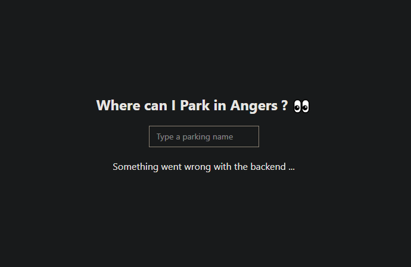

`WIP`

> Notes : 

two way of doing it : 
- easy one => https://www.aaron-powell.com/posts/2022-06-29-deploy-swa-with-bicep/ : basically you create the resource on azure with some properties and azure provides you the yaml file containing ci-cd code to deploy your app on this SWA
it also allow you, by default to get a temporary environment that is created and testable in a pull-request https://learn.microsoft.com/azure/static-web-apps/preview-environments

- "harder one" but more customisable and more adapted for most real-world use-cases : deploy bicep resource and then the app on it as we did with backend https://github.com/aaronpowell/aaronpowell.github.io/tree/main/.github/workflows/  => this get inspiration on the pipeline azure is giving you by default

bicep
create swaLocation param => swa are restricted to some locations (create GH secrets and pass it)

https://medium.com/codex/publish-azure-static-web-apps-using-a-bicep-template-ca315a825b74

for god sake 
https://github.com/Azure/static-web-apps/issues/868
https://github.com/sinedied/azure-checkin/blob/main/scripts/deployment/create-infra.sh

deploying swa with bicep One or more properties, including the resource name, are missing. Please add them and retry.
dont make the error that cost me 2h of debugging ... properties object, even empty, is mandatory !

get the swa app name

get the token and store it two options : 
1 - go to azure portal and look for the deployment token on the resource and then store it as a repository secret (or whatever other level)  (you could also store in a third party vault and connect it to your github, with AzKeyVault for instance)
2 - get the token during job and store it in temporary env variable :warning: do not display it !!!!! https://docs.github.com/en/actions/writing-workflows/choosing-what-your-workflow-does/workflow-commands-for-github-actions#setting-an-environment-variable

sol 2 chosen (it is more modular, you don't need to first deploy your infra and then get the token on azure and then run your deploy app job again, can do all at one time)

:warning: microsoft doc show this command to get token : https://learn.microsoft.com/azure/static-web-apps/static-web-apps-cli-deploy#:~:text=Manage%20deployment%20token-,Azure%20CLI,-%3A%20Using%20the%20secrets
but this give your token (basically a guid) in " " characters, need to ad "-o tsv" to remove those and use it directly

our app is now deployed let see how wonderfull it looks ! 

wait ... what ? 

seems we need to step into some troobleshooting :eyeglasses: